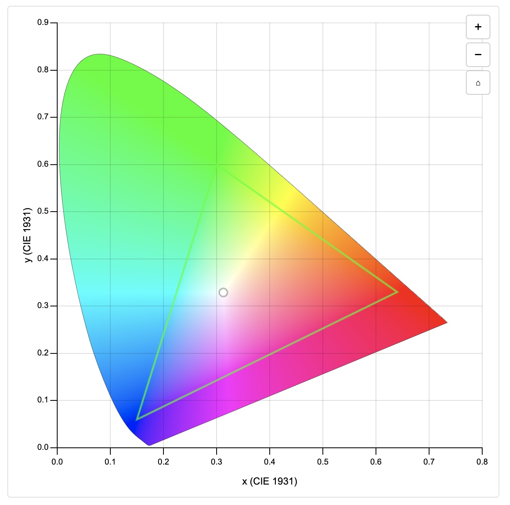

# [react-cie-1931](https://derekrein.github.io/react-cie-1931/)



A React component for rendering an interactive CIE 1931 chromaticity diagram with WebGL-accelerated rendering.

## Overview

The CIE 1931 color space, also known as the CIE XYZ color space, is a fundamental model for representing colors based on human perception. Developed by the International Commission on Illumination (CIE) in 1931, it maps all visible colors within a horseshoe-shaped diagram, often referred to as the chromaticity diagram. This diagram represents:

- **Chromaticity**: The x and y coordinates on the diagram correspond to the color's hue and saturation, independent of brightness.
- **Color Gamut**: The outer boundary shows the purest, most saturated colors (monochromatic light), while the interior represents mixed or less saturated colors.
- **White Point**: The central area approximates neutral or white light.

This React component, `react-cie-1931`, renders an interactive version of the CIE 1931 chromaticity diagram with smooth performance and accurate color representation, making it ideal for color science, design, and digital imaging applications.

## Features

- **Interactive Zoom & Pan**: Mouse wheel to zoom, click and drag to pan
- **WebGL Rendering**: Smooth performance with hardware acceleration
- **Multiple Color Spaces**: Display and compare different color gamuts
- **Planckian Locus**: Optional black-body radiation curve
- **Accessibility**: ARIA labels and keyboard navigation support
- **Responsive Design**: Adapts to container size with proper scaling

## Requirements

- **React 19.0+** - This component is built specifically for React 19 to take advantage of the latest features and optimizations.

## Installation

To use the `react-cie-1931` component in your React project, follow these steps:

1. **Install the package** via npm or pnpm:
   ```bash
   npm install react-cie-1931
   # or
   pnpm add react-cie-1931
   ```

2. **Import the component** into your React application:
   ```jsx
   // Named import (recommended)
   import { ChromaticityDiagram } from 'react-cie-1931';
   
   // Or default import
   import ChromaticityDiagram from 'react-cie-1931';
   
   // With TypeScript types
   import { ChromaticityDiagram, type ChromaticityDiagramProps } from 'react-cie-1931';
   ```

3. **Use the component** in your JSX:
   ```jsx
   <ChromaticityDiagram />
   ```

## Basic Usage

The `ChromaticityDiagram` component can be used as-is for a default visualization of the CIE 1931 color space. You can customize its appearance and behavior with various props:

```jsx
<ChromaticityDiagram
  colorSpaces={[
    {
      name: "sRGB",
      primaries: { r: [0.64, 0.33], g: [0.3, 0.6], b: [0.15, 0.06] },
      whitepoint: [0.3127, 0.329],
      color: "rgba(255, 0, 0, 0.8)"
    },
    {
      name: "Display P3",
      primaries: { r: [0.708, 0.292], g: [0.17, 0.797], b: [0.131, 0.046] },
      whitepoint: [0.3127, 0.329],
      color: "rgba(0, 255, 0, 0.8)"
    }
  ]}
  showPlanckianLocus={true}
  colorSpace="display-p3"
  axisLabelColor="#333"
  gridLineColor="rgba(0, 0, 0, 0.2)"
/>
```

## Learn More

Explore the [interactive Storybook documentation](https://derekrein.github.io/react-cie-1931/) to see examples and learn about the customization options available for the `react-cie-1931` component.

For more information, source code, and to report issues, visit the GitHub repository: [github.com/derekrein/react-cie-1931](https://github.com/derekrein/react-cie-1931).
